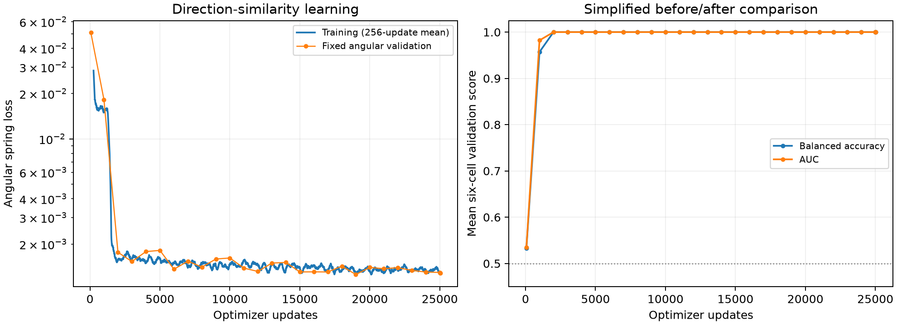

# Angular contrastive motion: implementation and completed experiment

The fresh convolutional encoder completed 25,024 updates and learned an embedding
distance that perfectly separated change from no-change on the selected model's
six synthetic test cells. Angular-distance calibration also improved substantially
relative to a collapsed embedding. These results concern explicitly supervised,
constant-direction full-field dot clips, not the original cued Krauzlis task.

The final operational evaluation contains 3,072 **presentations in 1,536 paired
nuisance contexts**. Adjacent change/no-change presentations share their nuisance
variables and complete before clip. They are not 3,072 fully independent trials.
Only the validation-selected checkpoint 19000 received the final held-out test;
latest 25024 was retained and validated, but was not separately final-tested.

## Question and scope

Could a new CNN learn motion-direction similarity directly when the training
objective explicitly specifies how representation distance should vary with
inter-clip direction difference? Each input is a three-frame constant-direction
clip. The network receives pixels only; simulator direction angles supervise the
pair loss. This is supervised metric learning, not unsupervised motion discovery.
The task uses no cue, distractor, fixation, response head, predictive reconstruction
or variational KL term. All learned weights start fresh and remain trainable.

The implementation is [model.py](model.py), [dataset.py](dataset.py) and
[train.py](train.py). The reused [TripletEncoder](../ThreeFrameConvVAE/model.py)
and [residual/compression blocks](../TwoFrameRViT/model.py) supply architecture
code, not trained weights. The [actual configuration](LocalRuntime/run/config.json)
records an empty checkpoint-input list and fresh whole-model initialization.

## Architecture and tensor layout

Both members of a pair pass through the **same** encoder. Three ordered RGB frames
reshape frame-major from `[B, 3,3,100,100]` to `[B, 9,100,100]`, then subtract 0.5.

| Operation | Output shape | Learned parameters |
|---|---|---:|
| Nine-channel 3×3 stem, GroupNorm/GELU, two 32-channel residual blocks | B×32×100×100 | 39,776 |
| PixelUnshuffle(2), 3×3 projection, GroupNorm/GELU, two 64-channel residual blocks | B×64×50×50 | 221,824 |
| Same compression pattern to 128 channels | B×128×25×25 | 886,016 |
| Replicate-pad bottom/right to 26×26, same compression to 256 channels | B×256×13×13 | 3,541,504 |
| Global spatial mean | B×256 | 0 |
| Linear 256→128, GELU, Linear 128→128 | B×128 | 49,408 |
| L2 normalization, epsilon 1e-6 | B×128 | 0 |
| **Total** | **One 128-vector per clip** | **4,738,528** |

Each residual block has two stride-one 3×3 convolutions with GroupNorm(8) and a GELU
residual activation. All convolutions use stride 1; resolution changes come from
space-to-depth compression, rather than pooling. The CNN has 60 trainable tensors
and the projection has 4, for 64 total. Global averaging discards spatial addresses
at the final readout. There is no recurrent state, transformer or separate
classifier. Nonreentrant activation checkpointing recomputes the encoder during
backward while preserving the complete clip gradient. All floating computations
and trainable weights use FP32.

## Exact objective and spring interpretation

For simulated directions `theta_a` and `theta_b`, the shortest circular angular
difference is `Delta = abs(wrap(theta_b-theta_a))`, in [0,pi]. The sampler constructs
this difference directly, while `angular_difference()` implements the same circular
wrap rule. Let `a` and `b` be the normalized embeddings, `u=a-b`, and `r=||u||2`.
The implementation uses a smooth distance, not the unmodified Euclidean norm:

```text
s = sqrt(r^2 + 1e-8)
d = s - 1e-4
m = Delta / pi
L_pair = 0.5 * (d - m)^2
L_batch = mean(L_pair)
```

Subtracting 1e-4 makes identical embeddings have distance zero. The target ranges
from 0 to 1; normalized-vector distances can extend to approximately 2. Thus an
opposite-direction pair targets distance 1, not necessarily antipodal unit vectors.
This is a graded spring objective, not binary-margin contrastive loss or InfoNCE.

For an individual pair, before the batch-mean factor:

```text
dL/dd = d - m
grad_a(L) = (d - m) * u / s
force_a = -grad_a(L) = (m - d) * u / s
signed radial force = (m - d) * r / s
```

When distance is below its target, gradient descent pushes the embeddings apart;
when it is above target, it pulls them together. Same-direction pairs have target
zero. At a fixed nonzero separation, increasing `Delta` increases the outward
radial force linearly. The actual force is **not simply proportional to angular
difference at every state**: it depends on current distance, vanishes at the target,
can reverse sign, and includes the smoothing factor. At exact coincidence,`u=0`
and the embedding gradient is zero even for a nonzero angular target. Unit
normalization and the CNN add their own Jacobians before this force reaches model
weights. Collapse therefore remains a possible stationary behavior, motivating
the reported collapsed-distance baseline.

The pairwise embedding-learning background is
[Hadsell, Chopra and LeCun, *Dimensionality Reduction by Learning an Invariant Mapping*](https://ieeexplore.ieee.org/document/1640964).
Our continuous angular target, smooth distance and spring coefficient are
implementation choices. Neither that paper nor this run establishes an exact
Euclidean realization of all circular angular distances.

## Training clips and supervision

[Angular pair generation](dataset.py) uses independent train/validation/test
namespaces 186101/186102/186103 and stateless indices. The first direction is uniform
on [0,2 pi). By `index modulo 3`, approximately one third of pairs have identical
directions, one third differ by either signed 26° or 28°, and one third differ by a
signed angle sampled uniformly from 45° to 180°.

Each clip independently draws 16–48 initial dot positions, its dot count and speed
from {0.375,1,2} pixels/frame. The second clip shares the prescribed angular relation,
but does not copy the first clip's nuisance variables. Even same-direction clips
have different dot layouts; speeds can differ within a pair. All dots within a
clip persist and move with one identical constant velocity for its three frames.
The [renderer](../VariationalMotionPredictor/dataset.py) uses Gaussian dots
(sigma 0.7, contrast 0.42 on gray 0.5), periodic 100×100 wrapping, a local 7×7 splat,
and clipping to [0,1]. RGB channels replicate the same luminance image.

Ground-truth direction differences from the simulator enter the objective as
`Delta/pi`. No angle, speed, dot coordinates, nuisance identity or pair-group
metadata enters the CNN. The experiment deliberately supplies angular supervision;
its success does not show that the earlier reconstruction objective could learn
this geometry without that supervision.

## Optimization, replay and actual exposure

The [saved configuration](LocalRuntime/run/config.json) specifies one Apple MPS
worker, FP32, two CPU threads, Adam learning rate 1e-4 and no clipping. The code uses
Adam's default betas(0.9,0.999), epsilon 1e-8 and zero weight decay. Initialization
seed 186211 seeds Python, Torch and MPS; shuffle seed 186212 drives epoch permutations.
No previous model, optimizer, RNG or data-stream state is loaded.

A fresh pool contains 1,000 pairs. Two independent shuffled epochs present every
pair twice before the pool is replaced. Each epoch has 31 batches of 32 pairs and
one batch of 8:32 updates/1,000 presentations, or 64 updates/2,000 presentations
per pool. Microbatches contain 4 pairs and therefore 8 CNN clip inputs. Loss
normalization uses the actual batch size, including the final partial batch.
The worker checks that every learned gradient exists and is finite before Adam.

| Completed quantity | Value |
|---|---:|
| Optimizer updates | 25,024 |
| Fresh pools | 391 |
| Unique training pairs | 391,000 |
| Pair presentations, including replay | 782,000 |
| Clip presentations through the CNN | 1,564,000 |
| Mean training loss over final 100 updates | 0.0012886712 |

The [progress log](LocalRuntime/run/progress.jsonl) contains 25,024 rows. The
[step 1 production proof](LocalRuntime/production_verified.json) records 64 persisted
Adam states and fresh initialization. The [completion verification](LocalRuntime/completion_verified.json)
records best 19000/latest 25024 with 64 Adam states each. Only those two checkpoint
files are retained at [best.pt](LocalRuntime/run/best.pt) and [latest.pt](LocalRuntime/run/latest.pt).

The [budget](LocalRuntime/run/budget.json) began on October 4, 2026 at 08:37:56 PDT
(15:37:56 UTC), with an eight-hour hard deadline of 16:37:56 PDT and a science cutoff
three minutes earlier. The run finished at 12:06:29 PDT (19:06:29 UTC): 3 hours, 28 minutes, 33 seconds,
approximately 3 hours 29 minutes, including model construction, pool generation, training,
validation and final evaluation. It stopped for `planned_complete`, not the cap.
The [supervisor result](LocalRuntime/run/local_supervisor_result.json) is complete
and the [guard result](LocalRuntime/run/guard_result.json) records normal owner exit.
There was no cap extension or cloud rental for this run.

## Validation, threshold fitting and checkpoint selection

Validation occurs at update 64, every 1,000 updates and terminal 25024: 27 looks in all.
Every look reuses 192 fixed independent angular pairs and 768 fixed operational
comparison presentations. The operational examples are 384 paired nuisance contexts,
64 contexts per speed/angle cell. They use the separate
[PredictiveMotionChange generator](../PredictiveMotionChange/dataset.py), validation
namespace 185102 and indices 12,000,000 onward.

For each checkpoint, a single distance threshold is fitted on validation by
maximizing overall comparison accuracy over sorted-score midpoint candidates;
equal class/cell counts make this an equally balanced comparison. Prediction is
`change = distance > threshold`. A single threshold serves all six speed/angle
cells; there are no per-condition thresholds. Checkpoint selection maximizes
mean six-cell validation AUC, breaking ties by lower angular validation loss;
remaining ties retain the earlier checkpoint. Balanced accuracy is reported but
is not the checkpoint-selection tie-breaker.

| Update | Angular validation loss | Mean comparison AUC | Mean comparison BA |
|---:|---:|---:|---:|
| 64 | 0.05080638 | 0.53474935 | 0.53255208 |
| 1,000 | 0.01822731 | 0.98217773 | 0.95703125 |
| 5,000 | 0.00181742 | 1.00000000 | 1.00000000 |
| 10,000 | 0.00161799 | 1.00000000 | 1.00000000 |
| 15,000 | 0.00130726 | 1.00000000 | 1.00000000 |
| **19,000, selected** | **0.00125669** | **1.00000000** | **1.00000000** |
| 25,024, terminal | 0.00128798 | 1.00000000 | 1.00000000 |

The selected [19000 validation](LocalRuntime/run/validation_019000.json) fits threshold
**0.08698047697544098**. The [terminal validation](LocalRuntime/run/validation_025024.json)
has a different fitted threshold 0.0801989808678627, which was not substituted for
the selected threshold in the final test. Test labels influence neither threshold
fitting nor checkpoint selection.

## Selected-checkpoint final results

The [final report JSON](LocalRuntime/run/report.json) evaluates the selected 19000
model using its validation threshold. Angular testing uses 384 new pairs in
namespace 186103; operational testing uses 3,072 presentations at indices 24,000,000
onward in namespace 185103. These sets are held out from this experiment's training
and threshold fitting.

| Angular test metric | Measured value |
|---|---:|
| Pairs | 384 |
| Angular spring loss | 0.0013643201 |
| Collapsed-distance baseline loss | 0.0799425021 |
| Distance/normalized-angle Pearson correlation | 0.9878348708 |
| Mean same-direction distance | 0.0058306991 |

The angular set has 128 pairs in each of the same/task-angle/broad-angle groups.
The collapsed baseline assigns distance zero to every pair; it is an analytic
loss reference, not a separately trained control model.

| Speed, pixels/frame | Changed direction, degrees | Presentations | Paired contexts | BA | AUC |
|---:|---:|---:|---:|---:|---:|
| 0.375 | 26 | 512 | 256 | 1.000 | 1.000 |
| 0.375 | 28 | 512 | 256 | 1.000 | 1.000 |
| 1.0 | 26 | 512 | 256 | 1.000 | 1.000 |
| 1.0 | 28 | 512 | 256 | 1.000 | 1.000 |
| 2.0 | 26 | 512 | 256 | 1.000 | 1.000 |
| 2.0 | 28 | 512 | 256 | 1.000 | 1.000 |
| **Total/mean** | | **3,072** | **1,536** | **1.000** | **1.000** |

Each cell contains 256 change and 256 no-change presentations. Balanced accuracy
averages change hit rate and no-change specificity. AUC counts positive/negative
score ordering, with half credit for ties. No learned FFN or classifier was trained;
embedding distance and the fixed selected threshold supply the decision.

## Dependence, interpretation and limits

The operational generator seeds nuisance draws by `index//2` and assigns the label
by `index%2`. Consequently, adjacent no-change/change examples share initial dot
positions/count, speed, base direction, change sign and the entire before clip.
Their first after frame is also identical: it starts where the original motion
would place frame 3; the new direction governs subsequent transitions 3→4→5.
No-change examples keep moving, rather than becoming static images.

Thus 3,072 presentations represent 1,536 paired nuisance contexts, and 512 per cell
represent 256 contexts. The pairing is useful for controlling nuisance effects,
but uncertainty analyses would need to respect those pairs. The saved run reports
point estimates and no confidence intervals; it does not justify treating every
presentation as an independent Bernoulli observation. Validation has the analogous
768-presentation/384-context dependence. Angular calibration uses a different
sampler: its independently rendered pair members share only their specified
angular relationship.

The positive conclusion is specific: a fresh CNN learned a supervised motion
similarity representation that separated the trained synthetic change conditions
on held-out examples. It does not establish native Krauzlis acquisition, selective
attention, cue following, delay maintenance, resistance to distractors or robustness
to incoherent motion and finite dot lifetimes. Here dots fill the field, persist
and wrap periodically; all share one constant direction within each clip; all
three speeds and 26°/28° test changes were represented in training. There is no
held-out speed, direction sector, dot renderer or native stimulus evaluation.

This is one initialization/run and one synthetic setting, not a repeat-seed
replication. The previous frozen predictive-encoder FFN failure used a different
objective, parameter-training policy and data exposure. Its contrast with this
result is informative history, not a controlled causal isolation of contrastive
loss or proof that predictive representations lack motion information. Further
training or native-task transfer requires a separate authorized experiment.


## Publication and saved-artifact visualization



These curves were generated from the completed progress log and fixed validation snapshots; no new model inference or training was run. Training loss is a256-update rolling mean. Repeated validation points reuse the same examples; they do not represent independent replications. The final report above is the fresh selected-checkpoint test. [SVG figure](figures/learning_curves.svg) and [rendering script](render_learning_curves.py).

Checkpoint links above identify retained local files. The `.pt` files are excluded from Git under the existing repository policy; [checkpoint identities](LocalRuntime/checkpoint_manifest.json) and [documented environment](LocalRuntime/environment_documented.json) are versioned. See [artifact/reproduction notes](../../LabJournal/ARTIFACTS.md). The original run did not pin every source file by hash. Publication-time changes add a guard against fitting a missing threshold on test data; this does not change model/loss/dataset or the completed run, which already supplied the validation threshold.
