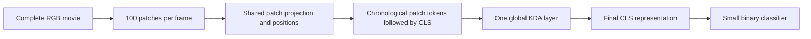

# Single layer KDA for whole visual sequences

**Run completed:** 4,216 updates / 134,912 episodes; selected and terminal models both scored 50% balanced accuracy in all three native conditions, predicting change on every final trial. Checkpoints retrieved and verified; pod stopped and deleted. [Final run status](RUN_STATUS.md). Earlier launch wording below is historical.

Design dated 2026-10-02. The user requested a simpler whole-sequence patch model and explicitly specified **one KDA layer**, with the response decoded from CLS, then authorized implementation and pod training. **The fresh model is training on A40 pod `8gamd8ems1pa0n`.** Native profiling fixed4,216updates/134,912episodes inside a new8h/$5 creation-origin cap; checkpoint3 was downloaded, SHA-256 verified and CPU-reloaded with all27Adam states advanced. [Run status and evidence](RUN_STATUS.md). No held-out acquisition result is claimed yet.

## Architecture

The model accepts the complete native RGB movie as `[B,T,3,100,100]` in one forward call. It patchifies every frame without resizing or discarding frames. One shared projection embeds the patches; one global KDA layer processes their ordered sequence; a small classifier reads only the final CLS representation. Every learned parameter starts fresh and is trainable.



| Component | Fixed first design |
|---|---|
| Image input | Native 100 by 100 RGB, centered by subtracting 0.5 |
| Patch grid | Nonoverlapping 10 by 10 pixel patches; 10 rows by 10 columns |
| Patch embedding | Flatten 300 RGB values, shared Linear 300 to 128, GELU, LayerNorm 128 |
| Position features | Learned row and column embeddings, each 10 by 128; fixed temporal sine and cosine features |
| Token order | Increasing frame index; row then column within each frame; one learned CLS appended last |
| Token width | 128 |
| Sequence mixing | Exactly one global KDA layer with two heads, key dimension 64 and value dimension 64 per head |
| KDA projections | Separate learned dense q, k, v and decay projections, each 128 to 128; write projection 128 to 2 |
| Layer normalization | LayerNorm before KDA; LayerNorm on final residual CLS before classification |
| KDA output | Concatenate the two head reads, Linear 128 to 128, residual addition to the input token |
| Classifier | Final CLS only, Linear 128 to 256, GELU, Linear 256 to 2 |
| Initial state | Zero global matrix for each head and trial |

The constructed model has **158,340 parameters across 27 trainable tensors**, matching the original analytical count including biases and three LayerNorms. Its global state has 8,192 FP32 values per trial, or 32,768 bytes. Activation and full-gradient memory are additional and must be measured on the pod. [Backend and CPU evidence](BACKEND.md) document the implementation.

There is no separate full-frame token: the 100 patches collectively represent each complete image. There is no CNN encoder, spatial KDA stack, GRU, ConvGRU, second KDA pass, softmax attention or direct pixel-to-classifier route. A two-head layer is still one layer. No additional tokenwise feedforward block is needed because the classifier already supplies a nonlinearity after the only sequence mixer.

## Position and motion

For a patch at frame t, row r and column c, its input token is its embedded RGB patch plus learned row and column embeddings plus a fixed 128-dimensional temporal feature. Use paired sine and cosine channels with the standard exponentially spaced periods and the actual integer frame index. Do not normalize time separately for each movie: the same frame index should mean the same elapsed time across B12, B20 and B28.

RGB subpixel intensities remain in the patch input. There is no temporal averaging, frame stacking, optical flow, crop to the known dot apertures or event-phase input. The KDA must learn to relate successive appearances. The proposed 10-pixel patches reduce token count while keeping individual pixel intensities available to the projection; their effectiveness for 0.375-pixel dot movements remains an empirical question. Position features distinguish both spatial locations and temporal order. No patch permutation augmentation is introduced.

The native renderer produces 29, 37 and 45 frames for B12, B20 and B28. With CLS, those are **2,901, 3,701 and 4,501 tokens**. These lengths follow `17 + baseline_transitions` in the existing renderer, not a new timing protocol.

## Meaning of whole sequence processing

All patch embeddings and input-dependent projections are computed over the full movie together. KDA then applies its ordered gated delta computation, ideally using a differentiable chunkwise implementation. Whole-sequence input does not make KDA bidirectional: a patch read depends on the tokens at or before it. Appending CLS ensures its read has access to the accumulated entire trial. Putting CLS first would prevent that access in a single causal layer.

The [official KDA reference](https://github.com/fla-org/flash-linear-attention/blob/main/fla/ops/kda/naive.py) defines decay, key-conditioned correction and updated-state read. The [official chunk API](https://github.com/fla-org/flash-linear-attention/blob/main/fla/ops/kda/chunk.py) supplies the corresponding full-sequence training interface. This design adopts the operator rather than the complete language-model architecture or its pretrained weights.

For each token and head, with state M stored as key by value:

```text
q = L2_normalize(Wq LayerNorm(token) + bq)
k = L2_normalize(Wk LayerNorm(token) + bk)
v = Wv LayerNorm(token) + bv
log_alpha = -softplus(Wdecay LayerNorm(token) + bdecay)
beta = sigmoid(Wwrite LayerNorm(token) + bwrite)

D = exp(log_alpha)[:, None] * M
M = D + beta * outer(k, v - k @ D)
read = q @ M
output_token = token + Wo concatenate(head_reads) + bo
```

Use normalization epsilon 1e-6 and query scale **1.0**, explicitly overriding the official API's default inverse square root scaling if that API is used. CLS uses the same projections, gates and update rule as other tokens. Its learned content is distinct from patch tokens; it receives the temporal feature at frame index T, with no row or column embedding. Trial state resets on each call. Chunk boundaries must carry state and gradients without detaching.

Only the last output token is classified. With one layer, its query is determined by the learned CLS and the end-time feature, rather than an already contextualized cue representation. Cue-conditioned reporting must therefore be learned within the global state and classifier. This is a deliberate simplicity constraint and a possible limitation, not a promised solution.

## Initialization and numerical behavior

Use PyTorch default dense initialization, normal standard deviation 0.02 for learned position and CLS embeddings, and LayerNorm scale one and offset zero. Initialize decay and write projection weights to zero; their biases set the initial gates, and both weights and biases remain trainable.

Initialize the two heads' decay-only half-lives to **32 and 128 frames**. Since every frame contributes 100 updates, set each head's per-channel initial log decay to `-log(2)/(100 * half_life_frames)`. Under the negative-softplus parameterization, the bias is `log(expm1(log(2)/(100 * half_life_frames)))`: approximately -8.43731 and -9.82369. This produces alpha approximately 0.9997834 and 0.9999458. These are initialization choices, not constraints on learned memory timescales.

Initialize beta to **0.01**, with bias `log(0.01/0.99)`, to reduce initial repeated-key overwrite across thousands of patch updates. Both decay and correction affect actual retention; the stated half-lives describe only multiplicative decay. Reusing alpha 0.9 per patch would attenuate the state by approximately 0.0000266 over just one 100-patch frame and is inappropriate here.

Unit-length keys, alpha in (0,1] and beta in (0,1) bound the homogeneous update's operator norm by one; this does not bound learned value inputs or guarantee optimization stability. Use FP32 parameters, inputs, state, gate arithmetic and training computations, full temporal gradients, no clipping and TF32 disabled, matching the recent scientific recipe. Verify an optimized backend's actual intermediate precision and backward behavior before adopting it; an FP32 input signature alone is insufficient. Do not silently substitute BF16, detach state or shorten movies for throughput. A plain FP32 reference is required for parity, but its Python scan timing is not a production throughput estimate.

## Authorized training run

The initial experiment is **Krauzlis only**, with the unchanged native B12, B20 and B28 conditions and 26 or 28 degree direction changes. The separate historical plus or minus 90 degree task is not silently substituted. Preserve cues, dot rendering, trial lengths, target and foil assignment, 57 target / 29 foil / 14 catch cases per 100 native draws, labels and cross-entropy. No curriculum, angle labels, auxiliary loss or balanced-label resampling is added.

Use one fresh whole model, fresh Adam and independently initialized train, validation and test streams with zero counters. Proposed optimization matches recent runs: Adam 1e-4, betas 0.9 and 0.999, epsilon 1e-8, weight decay zero, effective batch 32 and microbatch 4. Microbatch losses must average to one batch loss before the single optimizer update. Rotate conditions equally using fresh recorded scheduling state.

Authorized target exposure is at most **10,000 updates / 320,000 episodes**, reduced before production if native forward/backward and evaluation profiling show that the allocation cannot fit. The cloud envelope is one A40 under a **new eight-hour / five-dollar total cap**, including setup, profiling, evaluation and retrieval. The cap starts at this new pod's creation, not local implementation. GPU price, library versions, exact seeds, measured allocation and deadline are recorded by the implementation and deployment receipts. Profiles must not supply weights or optimizer state to production. The guard stops compute independently of laptop retrieval; a bounded completion retrieval grace stays inside the absolute cap.

Retain two planned validation looks at midpoint and terminal, 100 trials per condition. Select by three-condition mean AUC, then balanced accuracy, then earlier checkpoint, as in the recent task-specific runs. Evaluate selected and terminal models on identical fresh final movies, 200 per condition. Report BA, AUC, confusion, target hit rate, foil false positives and catch false positives separately for every condition. An all-positive classifier has BA 0.5 despite 57 percent raw accuracy; acquisition must not be inferred from loss or aggregate accuracy alone. This is a new architecture package, not an isolated causal test of the old transformer.

## Implementation verification for the later run

Verify exact RGB patch coverage and reconstruction; token ordering and temporal positions; one KDA module; state resets between trials; and CLS-only routing. Compare reference and chosen chunk implementations' outputs, states and gradients on short sequences and a native-length B28 batch. Test a gradient from the CLS loss to early cue frames, and confirm carry across artificial chunk boundaries. Verify all intended parameter groups receive finite gradients and advance in a persisted optimizer checkpoint. Pin exposure after measured native profiling, then reuse the project's verified absolute-deadline shutdown, off-pod status and artifact retrieval mechanisms. This document itself launches none of those operations.

## Local evidence and decision

The prior [CLS transformer](../SpatialRecurrentTransformer/RESULTS.md) remained at chance on Krauzlis. The later [fresh task-specific model](../../LabJournal/krauzlis-fresh-attempt02.md) made all-positive decisions after 147,040 episodes. [Motion-specific frozen diagnostics](../../LabJournal/krauzlis-motion-readout-diagnostic.md) recovered changed side from pixels but did not establish a neural encoding lesion. Those findings motivate testing direct patch inputs and a simpler sequence computation; they do not establish that this architecture will learn the task.

Model/backend verification passed seven CPU tests, including all 4,501 tokens at the actual head dimensions. Output and final-state maximum absolute discrepancies from the ordered reference were 2.76e-7 and 6.11e-7; all input-gradient comparisons passed. A native-length synthetic movie gave finite earliest-frame gradients, and all 27 parameter tensors advanced in Adam. These are implementation checks, not native-task acquisition or GPU feasibility results. The remaining authorized work is task-specific adapter verification and bounded pod deployment, profiling and training. Preserve all historical models and results; no task-acquisition result is yet available.
