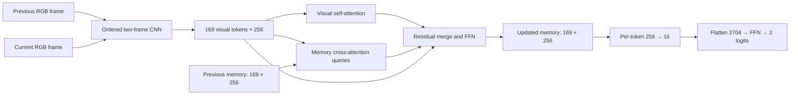

# Two-frame CNN → recurrent vision transformer

Implementation of the requested RViT variant for the unchanged native Krauzlis
task. **7,270,290 trainable parameters across 92 tensors.** All learned weights are new. The user now authorizes this model on a separate A40 alongside the active
sixteen-head KDA and local CNN-GRU. Training launch preparation is in progress.

## Computation



At frame t, concatenate `[frame_(t−1), frame_t]` along channels and subtract 0.5.
The first pair repeats frame 0, so the first frame introduces no synthetic motion.
This ordered six-channel input lets the CNN learn spatial and temporal filters
jointly; it receives no cue labels, timing metadata or motion oracle.

The CNN uses a 32-channel 3×3 stem and two residual blocks at each of 32/64/128/256
channels, with GroupNorm8 and GELU. The first residual stage operates at the full
100×100 resolution so motion features can be formed before compression. Three
space-to-depth rearrangements followed by learned 3×3 projections produce
100→50→25→13 spatial sizes. The last rearrangement replicates the bottom/right
boundary to 26 before halving. Every convolution has stride 1; no pooling is used.
Space-to-depth itself preserves pixel phases, while its subsequent learned
projection compresses them. This is still spatial downsampling and is not a
claim of lossless encoding or guaranteed retention of small motion.

The 13×13×256 output becomes 169 tokens of width 256. Learned row/column positions
preserve spatial address, including the visual cue's location. No CLS token is
needed for this decoder.

## Recurrent transformer

One transformer block shares its weights across all movie frames. Each attention
branch has eight heads of 32 dimensions and its own Q/K/V/output projections.
Both branches query the normalized current visual tokens X:

- Visual branch: `Q(X), K(X), V(X)`.
- Memory branch: `Q(X), K(H_(t−1)), V(H_(t−1))`.

Each branch has its own softmax. Thus visual and memory sources cannot consume
one another's share of a single joint attention normalization. Queries originate
from the visual input in both branches; the memory branch reads the prior updated
token grid. Positions already carried by memory are not repeatedly added to it.

The attention outputs are added with a 1/√2 scale and a residual around X, followed
by a pre-LayerNorm 256→1024→256 GELU FFN with its own residual. The result is H_t.
There is no GRU, state gate, extra transformer depth or growing history cache.
Initial memory is fixed zeros; learned parameters train throughout. The state is
169×256 = 43,264 floats per trial, independent of movie length. No temporal detach is
used. The model can learn recurrent retention through the memory attention, but
this architecture alone does not guarantee retention over blanks.

Spatial attention is global within the compact grid. Each branch has 169² = 28,561
attention pairs per head/frame, versus100million for attention over 10,000 pixels.
The 13×13 grid is an implementation choice to retain spatial structure while
keeping an actual full-sequence training run practical.

## Decoder and interface

Only the terminal updated grid reaches the task decoder. LayerNorm then a shared
learned Linear 256→16 and GELU reduce each token, preserving all 169 addresses.
Flattening yields 2704 features. The FFN is 2704→512→256→2 with GELU between hidden
layers, returning raw logits for ordinary two-class cross-entropy. There is no
spatial averaging or CLS bottleneck.

```python
from SecondPass.TwoFrameRViT.model import TwoFrameRViT
model = TwoFrameRViT()  # fresh weights
logits = model(images, "krauzlis_cued_motion")  # images: [B,T,3,100,100], FP32
```

`stream_step(current, previous_frame=None, memory=None)` returns logits, the
current raw frame to carry into the next call, and updated memory. Both carried
objects remain attached to their gradient history. A whole-movie call initializes
its own state and decodes only its last frame. The module stores no hidden cache,
so separate episodes do not contaminate each other.

Training-mode CNN activation checkpointing recomputes activations during backward
rather than retaining every full-resolution CNN intermediate from the entire
movie. It uses nonreentrant checkpointing and preserves full temporal gradients;
evaluation uses ordinary forward execution.

## Readiness

[Protocol](protocol.json) records the exact architecture and implementation-only
scope. Focused checks cover sequence/stream equivalence, shapes/order/reset,
previous-memory influence and gradients through both attention branches, CNN and
earliest frame. Native task integration is checked on a complete 45-frame B28
movie using CPU only. These checks establish implementation behavior, not task
learning or measured GPU feasibility.

Future training should use the existing fresh-weight native-task recipe:
Adam 1e-4, all parameters trainable, no clipping, FP32/full BPTT and TF32 disabled.
Actual microbatch/exposure require native accelerator profiling within an
explicit launch allowance. The subsequent explicit launch request authorizes one new eight-hour/$5
run, including setup/profile/training/evaluation/retrieval. Validation is100
trials per condition at update100, then every250updates and terminal; all looks
are costed before pinning exposure. Final selected/terminal tests use paired
fresh200trials per condition. Actual training requires persisted optimizer proof.

Three focused CPU tests passed in 1.04 seconds. A complete native B28 movie
(45 frames) passed the CPU interface check in 0.66 seconds.
[Model evidence](verification/model_cpu.json) ·
[Native movie evidence](verification/native_movie_cpu.json) ·
[Research journal](../../LabJournal/krauzlis-two-frame-rvit.md).
