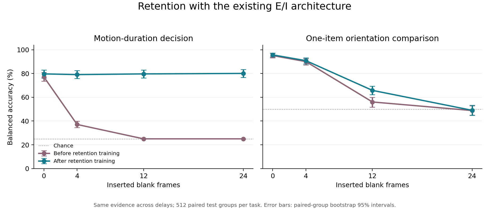

# Existing E/I retention learning

**Motion decisions remained about79–80% accurate through24 inserted blanks after training.** At24 blanks, accuracy improved from25.00% to80.08% (+55.08pp, paired95% CI[51.76,58.40]). The trained24-versus0-blank difference was+0.39pp (CI[−1.57,+2.34]): an observed near-flat curve, not a guarantee of perfect retention.

**Orientation comparison improved at12 blanks but remained unresolved at24.** At12 blanks, BA rose56.05%→65.82% (+9.77pp, CI[5.27,14.06]); at24 it was48.83%→49.02% (+0.20pp, CI[−3.71,+3.71]). This finite run with a frozen sensory-to-memory interface does not establish an architecture limit.

The motion winner can be determined before the blanks, whereas orientation match/change requires the later probe. This is a functional distinction in these tasks, not proof of separate biological memory systems or inherently easier decision retention. The parent still had motionD24 AUC0.7890 despite25% choice accuracy; the trained AUC was0.9364. The initial poor decisions therefore cannot be described as erased information.

Completed39,680 new training episodes. Validation selected step14800 (39,680 new episodes at selection).

| Task | Inserted blanks | Parent BA | Trained BA | Change, pp (paired95% CI) | Parent/trained AUC |
|---|---:|---:|---:|---:|---:|
|motion_D0|0|77.15%|79.69%|+2.54 [+0.39,+4.69]|0.9336/0.9399|
|motion_D4|4|37.11%|79.10%|+41.99 [+38.09,+45.90]|0.8923/0.9412|
|motion_D12|12|25.00%|79.69%|+54.69 [+51.37,+58.01]|0.8472/0.9414|
|motion_D24|24|25.00%|80.08%|+55.08 [+51.76,+58.40]|0.7890/0.9364|
|orientation_D0|0|95.12%|95.70%|+0.59 [-0.59,+1.76]|0.9857/0.9885|
|orientation_D4|4|90.04%|90.82%|+0.78 [-0.98,+2.34]|0.9641/0.9700|
|orientation_D12|12|56.05%|65.82%|+9.77 [+5.27,+14.06]|0.5693/0.7156|
|orientation_D24|24|48.83%|49.02%|+0.20 [-3.71,+3.71]|0.4812/0.5131|
|motion_direction_anchor|anchor|99.79%|99.38%|-0.41 [-1.02,+0.00]|1.0000/1.0000|
|orientation_anchor|anchor|98.99%|99.80%|+0.81 [+0.20,+1.61]|1.0000/1.0000|

The main cells share identical evidence/query/probe images across delays. D counts inserted cue-marked blanks: motion age isD+1 after final evidence, orientation sample-to-probe ageD+2, with the established query frame. No calibrated milliseconds or biological retention constant is implied.

The512 evidence groups per primary family are paired across four delays and two model views. Anchors contribute512 independent examples per family. Bootstrap draws preserve these groups;10240 model-delay presentations are2048 underlying evidence groups, not10240 independent examples. Main classes are balanced; anchor BA is explicitly the mean class recall even when anchor labels are imbalanced.

Fixed opponent traces remain an additional history-bearing route. Training the core and output together does not isolate which state or learned change produces the retention gains. Only existing recurrent-core parameters, memory_output and motion/orientation heads trained. Frozen encoder/opponent/memory_input/sensory trunk parameters remained exactly unchanged. Recurrent r/a updates retained full sequence gradients; no extra memory architecture or attention was added. Compatible Adam histories and task streams resumed from the selected refitted parent; the schedule is an explicitly versioned migration.

Training clipping fraction was63.75%; median preclip norm1.3814. Per-cell exposures, logical frame counts and early/late state-gradient statistics are in analysis.json. All checkpoints, optimizer/sampler/RNG/scheduler states, pinned source/config, logs and raw predictions are retained.

Initial baseline used the development set. All primary delays were included during training; validation selected by mean eight-cell AUC, with anchors descriptive. Final parent/trained comparisons used a separate fresh paired test set after selection. The unchanged parent is the baseline, not an equally exposed alternative training arm. One trained lineage and a finite horizon cannot prove architecture failure, optimality, a unique circuit mechanism or biological correspondence. No extrapolated delay, new condition or automatic extension was run.

All12 GPU workers exited successfully. Supervisor time was1953.89seconds (32.56minutes), including profile, baseline, training, validation and both final tests. Plotting and paired analysis used saved outputs only and finished within the original14400-second allowance. No additional experiment or cloud work was launched.
